# Тестування працездатності системи

## Відображення всіх сутностей (GET)

### Запит та результат

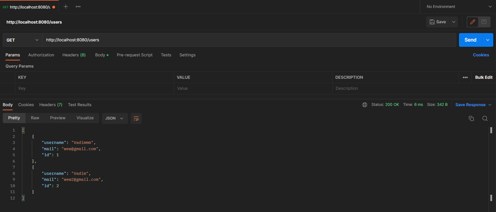

## Відображення однієї сутності по id (GET)

### Запит та результат

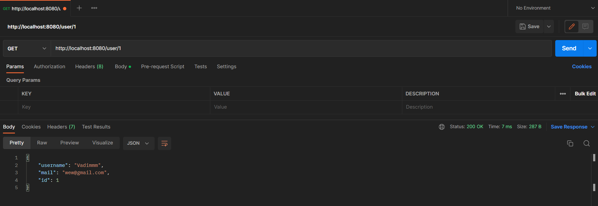

## Додавання сутності по id (POST)

### Запит

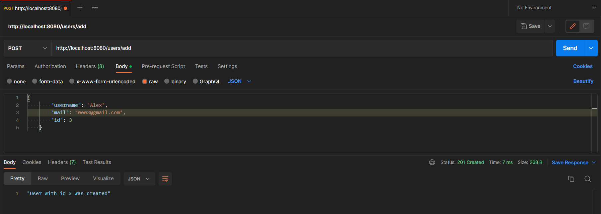

### Результат

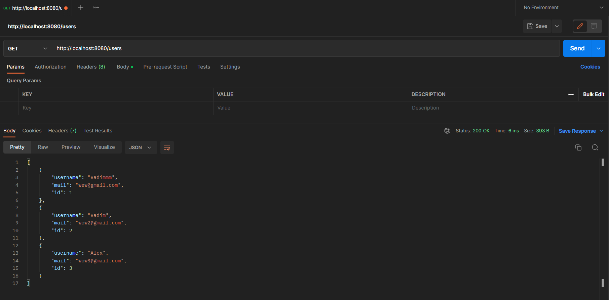

### Можливі помилки

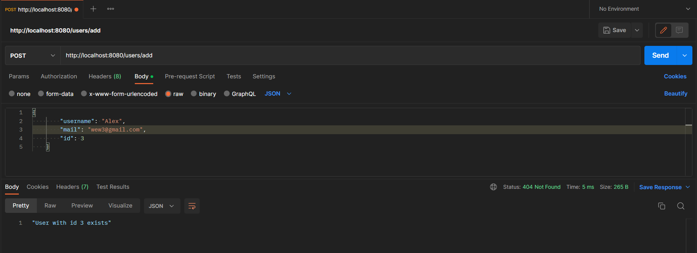

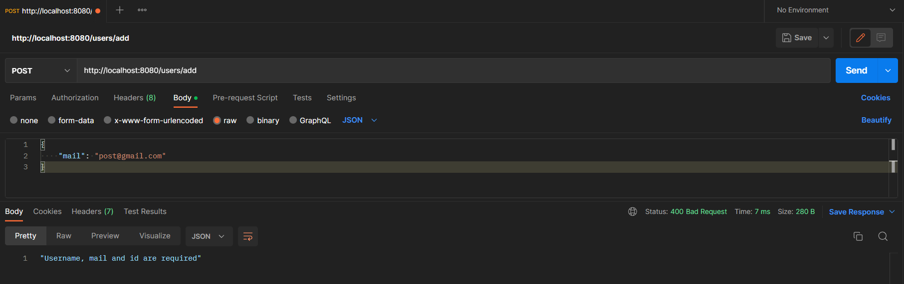

## Оновлення сутності по id (PATCH)

### Запит

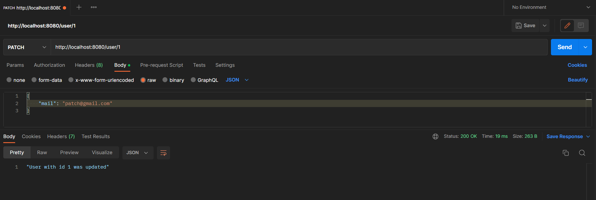

### Результат

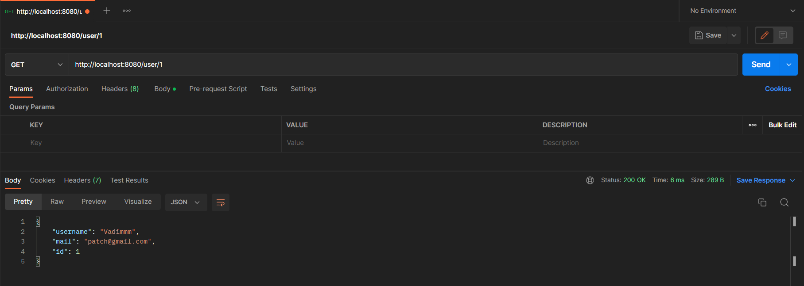

### Можливі помилки

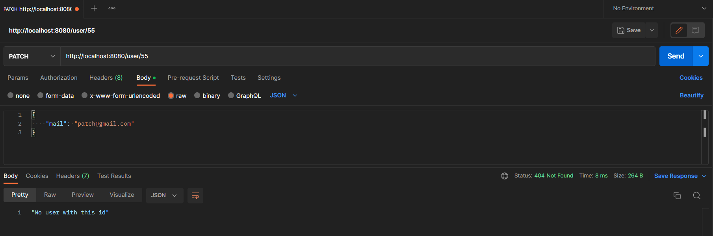

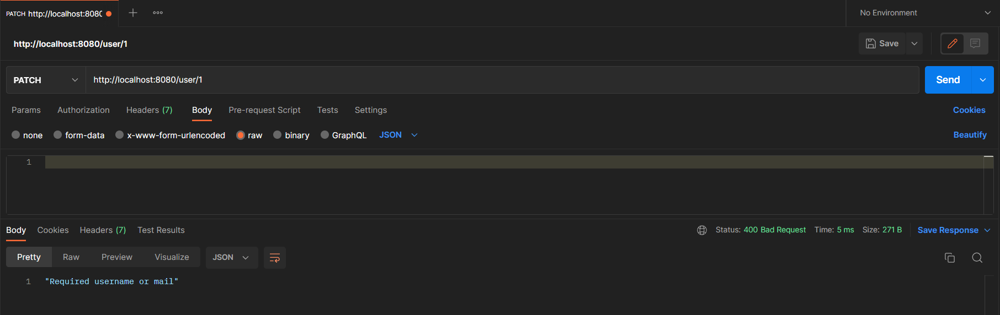

## Видалення сутності по id (DELETE)

### Запит

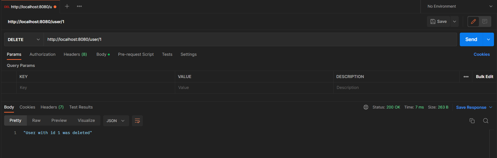

### Результат

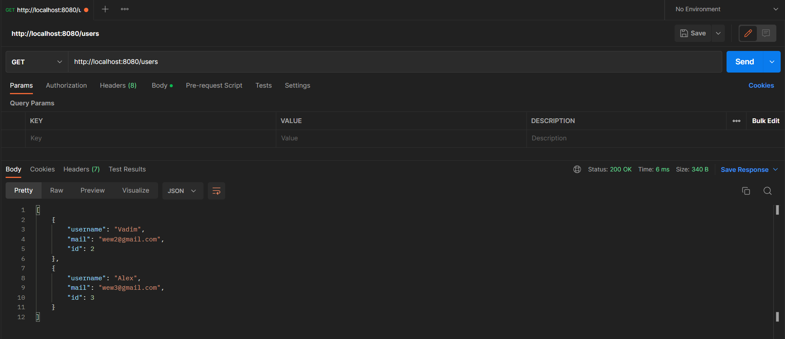

### Можливі помилки

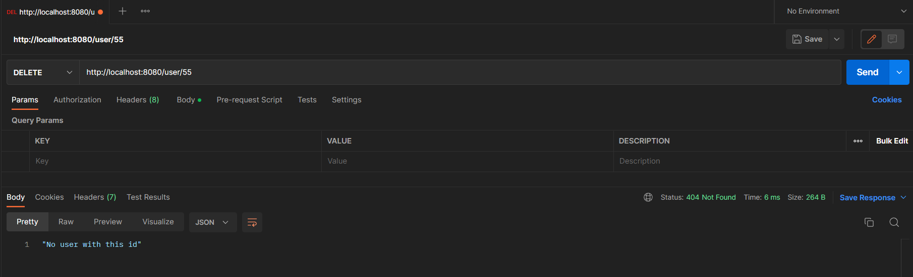
